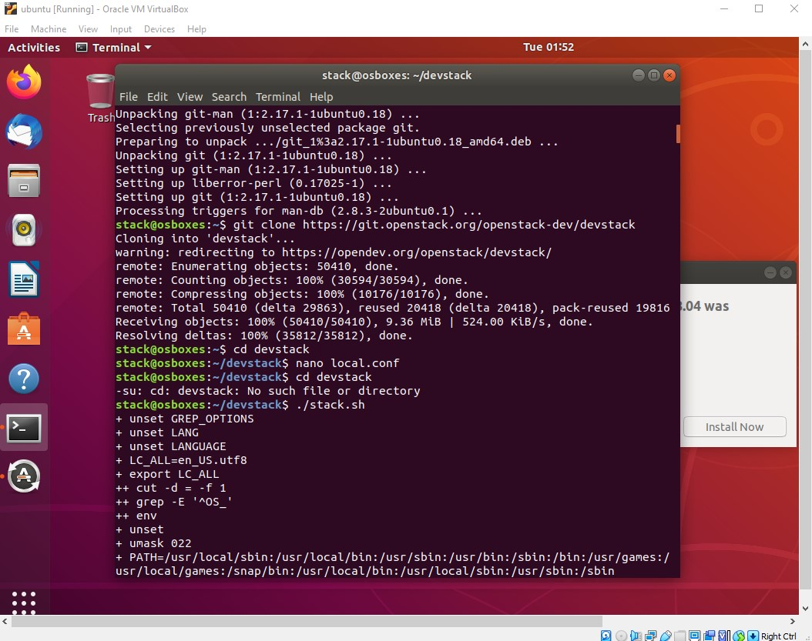

# Penerapan OpenStack di Ubuntu 18.04 menggunakan DevStack

## Persyaratan Minimum DevStack
- Instalasi baru Ubuntu 22.04/20.04/18.04
- Memori minimal 4 GB
- Setidaknya 2 vCPU
- Kapasitas penyimpanan 10 GB.
- koneksi internet

## Step 1: Update Ubuntu system
1. Masuk ke sistem Ubuntu Anda,lalu jalankan perintah berikut
  ```
  sudo apt update && sudo apt -y upgrade
  ```
  lalu restart ubuntu anda
## Step 2: Add Stack User
1.  jalankan perintah di bawah ini untuk membuat pengguna penerapan DevStack.
    ```
    sudo useradd -s /bin/bash -d /opt/stack -m stack
    ```
    
2. Aktifkan hak istimewa sudo untuk pengguna ini tanpa memerlukan kata sandi.
   ```
   echo "stack ALL=(ALL) NOPASSWD: ALL" | sudo tee /etc/sudoers.d/stack
   ```
3. Switch to user untuk melakukan test.
   ```
   jmutai@devstack:~$ sudo su - stack
   stack@devstack:~$ sudo su -
   root@devstack:~#
   ```

## Step 3: Download DevStack
1. Kloning Destack deployment code dari Github.
   ```
   su - stack
   sudo apt -y install git
   git clone https://git.openstack.org/openstack-dev/devstack
   ```
2. Buat `local.conf` file dengan 4 kata sandi dan alamat IP Host.
   ```
   cd devstack
   nano local.conf
   ```
   tambahkan :
   ```
    [[local|localrc]]

    # Password for KeyStone, Database, RabbitMQ and Service
    ADMIN_PASSWORD=StrongAdminSecret
    DATABASE_PASSWORD=$ADMIN_PASSWORD
    RABBIT_PASSWORD=$ADMIN_PASSWORD
    SERVICE_PASSWORD=$ADMIN_PASSWORD

    # Host IP - get your Server/VM IP address from ip addr command
    HOST_IP=192.168.10.100
   ```

## Step 4: Start Openstack Deployment on Ubuntu using DevStack
   1. mulai instalasi Openstack.
      ```
      cd devstack
      ./stack.sh
      ```
      Ini akan memakan waktu 15 – 20 menit, sebagian besar tergantung pada kecepatan koneksi internet Anda. Di akhir proses instalasi, Anda akan melihat      output seperti ini:
      ```
      This is your host IP address: 192.168.10.100
      This is your host IPv6 address: 2a01:4f8:c2c:308e::1
      Horizon is now available at http://192.168.10.100/dashboard
      Keystone is serving at http://192.168.10.100/identity/

      The default users are: admin and demo
      The password: StrongAdminSecret

      WARNING: 
      Using lib/neutron-legacy is deprecated, and it will be removed in the future

      Services are running under systemd unit files.
      For more information see: https://docs.openstack.org/devstack/latest/systemd.html
      DevStack Version: stein
      Change: 8bdbf850967b90ebdca428247bb93ad2eb6478c0 Merge "Set ownership of /etc/pki/ files for TLS" 2019-03-26 08:07:26 +0000
      OS Version: Ubuntu 18.04 bionic
      2019-03-26 21:32:56.743 | stack.sh completed in 1761 seconds.
      ```
      

## Step 5: Access OpenStack Dashboard
  1. Salin URL yang ditampilkan pada keluaran instalasi dan tempelkan ke browser web Anda:
     ```
     http://192.168.10.100/dashboard
     ```
     Gunakan pengguna default `demo or admin` dan kata sandi yang dikonfigurasi untuk login.

  2. Anda akan melihat konsol Web Manajemen Openstack setelah masuk.
     
     
