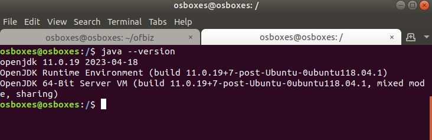

# MENGINSTAL APACHE OFBIZ

## persiapan menginstal ofbiz:
1. java(jdk)
2. ofbiz

langkah-langkah penginstalan :
1. instal java menggunakan perintah berikut :
```
$ sudo apt install default-jre -y
```
2. setelah selesai,cek java menggunakan perintah berikut :
 ```
$ java --version
 ```
berikut tampilan jika java sudah terinstal



3. 
