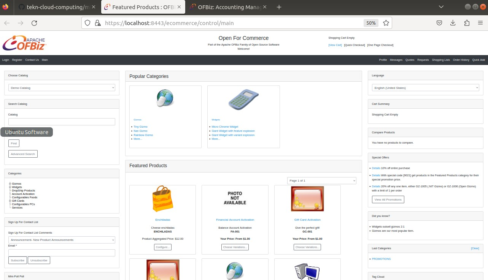

# MENGINSTAL APACHE OFBIZ DI LINUX UBUNTU

## persiapan menginstal ofbiz:
1. java(jdk)
2. ofbiz
3. gradle-wrapper.jar
4. gradle-warpper.properties

langkah-langkah penginstalan :
1. instal java menggunakan perintah berikut :
   ```
   $ sudo apt install default-jre -y
   ```
2. setelah selesai,cek java menggunakan perintah berikut :
   ```
   $ java --version
   ```
   berikut tampilan jika java sudah terinstal
   

3. lalu install apache ofbiz menggunakan perintah berikut ini
   ```
   $ wget https://dlcdn.apache.org/ofbiz/apache-ofbiz-18.12.08.zip
   ```

4. lalu unzip apache ofbiz yang telah di downlod dengan perintah berikut
   ```
   $ unzip apache-ofbiz-18.12.08.zip -d .
   ```

5. download gradle-wrapper.jar : https://github.com/gradle/gradle/blob/v5.0.0/gradle/wrapper/gradle-wrapper.jar
6. download gradle-warpper.properties : https://github.com/gradle/gradle/blob/v5.0.0/gradle/wrapper/gradle-wrapper.properties

7. copy gradle-wrapper.jar dan gradle-warpper.properties tadi ke direktori apache-ofbiz-18.12.08/gradle/wrapper/.
   ```
   $ cp gradle-wrapper.jar apache-ofbiz-18.12.08/gradle/wrapper/
   $ cp gradle-wrapper.properties apache-ofbiz-18.12.08/gradle/wrapper/
   ```

8. instal gradle
   ```
   $ sudo apt install gradle -y
   ```

9. lalu masuk ke dalam direktori ofbiz
   ```
   ./gradlew loadAll ofbiz
   ```

10. perintah ini akan mengunduh sekaligus menjalankan service Apache Ofbiz.proses ini akan cukup lama.anda bisa ngopi2 dulu

    berikut tampilan saat proses unduh dan service
    

    setelah selesai apache ofbiz akan berjalan ditandai dengan tampilan berikut :

    

    jangan tutup/close terminal agar apache ofbiz tetap berjalan

11. selanjutnya cek halaman menggunakan link berikut ini dibrowser : https://localhost:8443/accounting

    akan muncul tampilan sebagai berikut

    

12. login menggunakan
    ```
    User Name : admin
    Password : ofbiz
    ```

13. setelah berhasil login akan diarahkan ke halaman Accounting/main page

    berikut tampilanya

    

14. cek juga halaman https://localhost:8443/ecommerce

    berikut tampilanya

    

15. selesai
