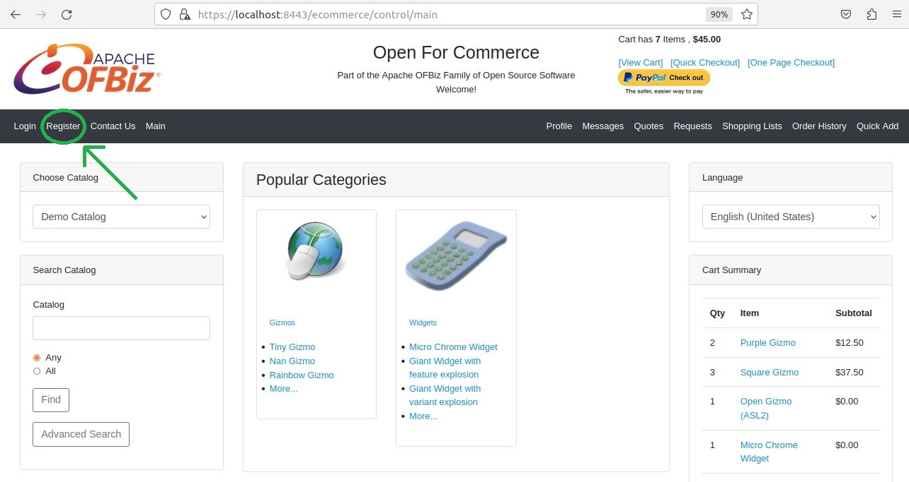
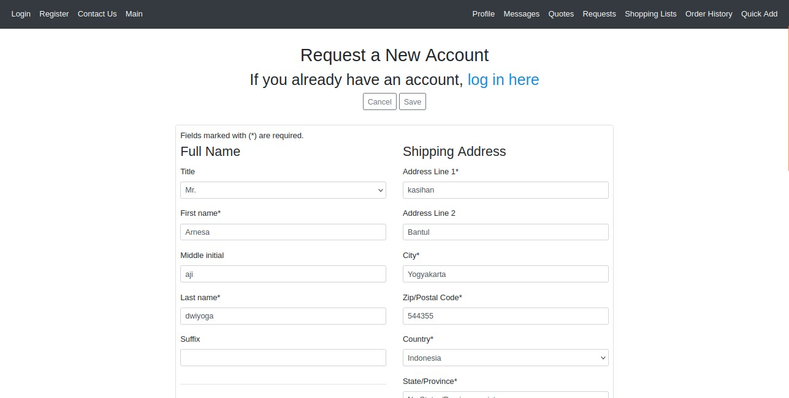
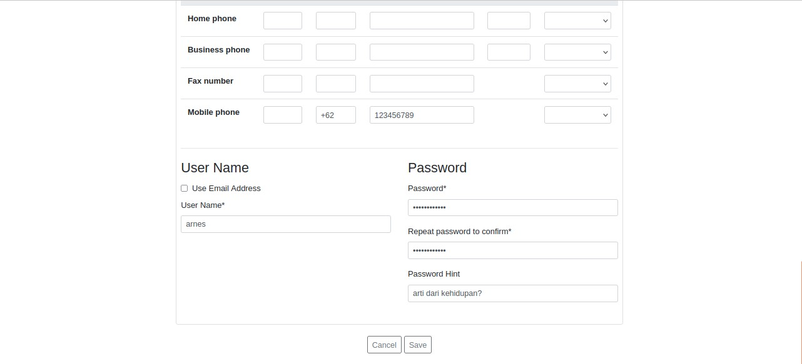
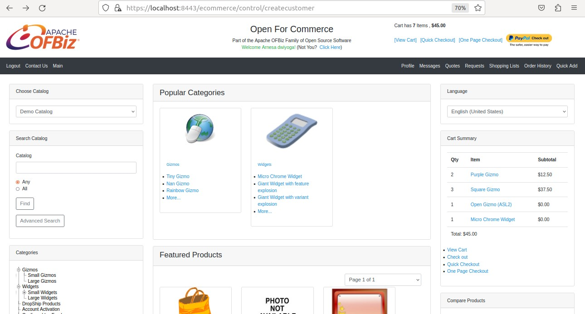

Dengan menggunakan fasilitas demo, pilihlah E-Commerce webstore atau backend ERP. Setelah itu, buatlah panduan dasar pemakaiannya. Anda bebas memilih tema (misal - panduan berbelanja di Webstore E-Commerce). Gunakan kreativitas anda.

# Panduan membuat akun di webstore E-Commerce

1. buka ecommerce melalui link berikut : https://localhost:8443/ecommerce
2. pilih menu registrasi
   

3. lalu anda akan di alihkan ke menu pengisian data diri
   
   

   lengkapi data diri anda,lakukan pengecekan kembali.bila dirasa sudah benar lalu klik save

4. Jika berhasil,Anda akan dialihkan ke halaman beranda E-Commerce
   

5. lakukan pengecekan akun yang telah anda buat dengan memilih menu profil
   
