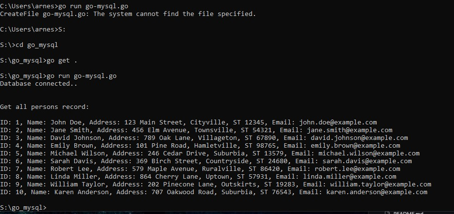
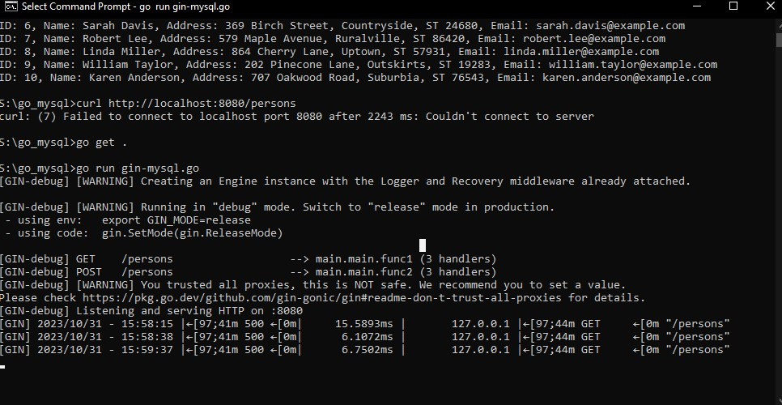
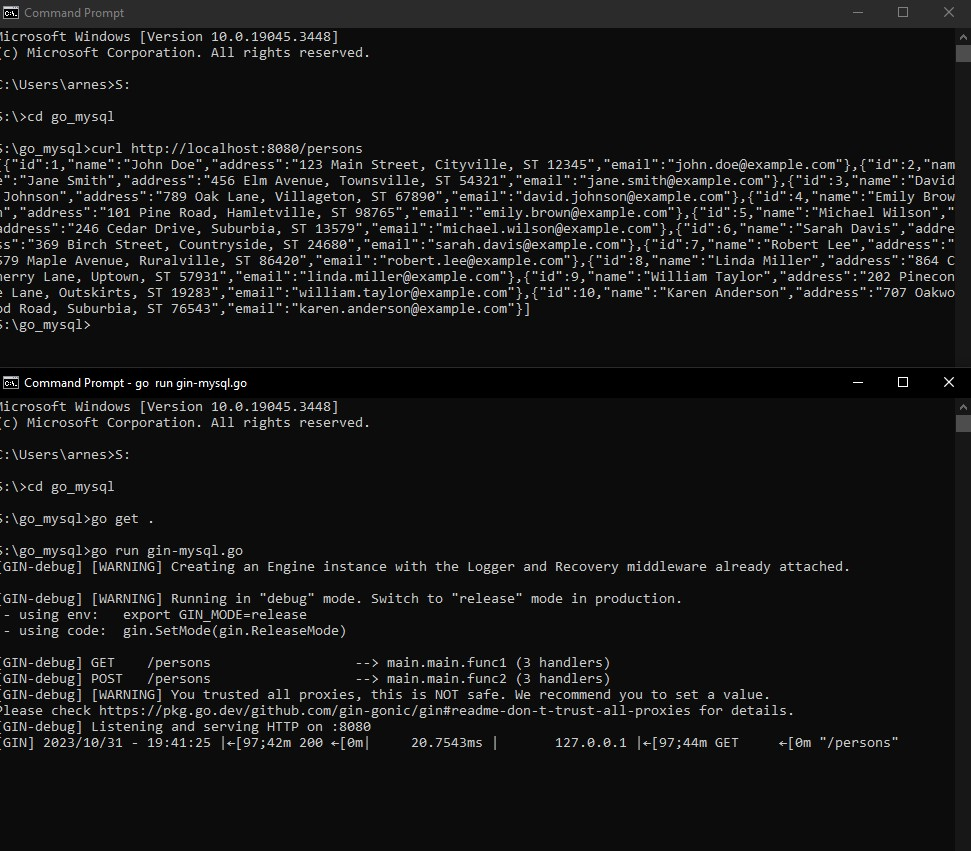

Software yang dibutuhkan
1. MySQL
2. Go


dua file yang akan dibutuhkan :
1. `go-msyql.go`
2. `gin-mysql.go`


# langkah pertama
## 1. instal MySOL
 


## 2. instal go


## 3. instal driver untuk go

lalu instal driver untuk go dengan mengetikan perintah berikut :
```
$ go get -u github.com/go-sql-driver/mysql
```


# langkah kedua

## membuat program Go untuk koneksi dan membaca data dari MySQL :

1. jalankan mysql lalu buat sebuah `database`
2. edit file `go-mysql.go`,ubahlah pada bagian berikut :
   ```
   db, err := sql.Open("mysql", "user:password@tcp(localhost:3306)/database_name")
   ```
   ubahlah pada user:password sesuai dengan user dan password yang anda gunakan, ubah pula /database_name sesuai database yang anda buat.

   kurang lebih seperti contoh dibawah ini :
   ```
   db, err := sql.Open("mysql", "root:admin@tcp(localhost:3306)/tekn_cloud")
   ```

3. jalankan file dengan perintah berikut ini :
   ```
   go get .
   go run go-mysql.go
   ```

   

   selesai.


## membuat RESTful API untuk membaca data dari MySQL menggunakan Gin

1. editlah file `gin-mysql.go` ,Ubah bagian kode berikut:

   ```
   db, err := sql.Open("mysql", "user:password@tcp(localhost:3306)/database_name")
   ```

   ubahlah pada user:password sesuai dengan user dan password yang anda gunakan, ubah pula /database_name sesuai database yang anda buat.

2. jalankan file dengan perintah berikut ini :
   ```
   go get .
   go run gin-mysql.go
   ```

   


3. Lakukan pengetesan dengan menggunakan perintah:

   ```
   curl http://localhost:8080/persons
   ```

   


   selesai.
   
