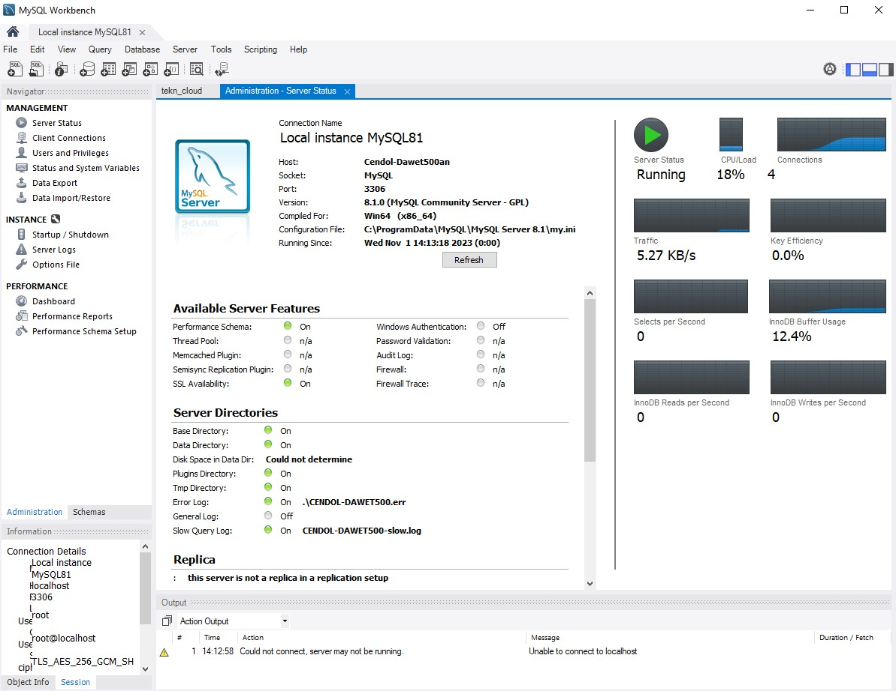
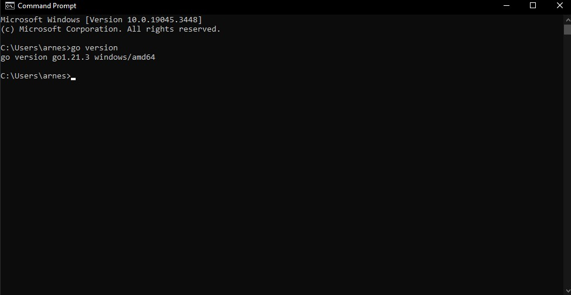

Software yang dibutuhkan
1. MySQL
2. Go


## instal MySOL
 


## instal go



akan ada 2 file :
1. `go-msyql.go`
2. `gin-mysql.go`


## langkah-langkah membuat program Go untuk koneksi dan membaca data dari MySQL :

1. jalankan mysql lalu buat sebuah `database`
2. edit file `go-mysql.go`,ubahlah pada bagian berikut :
   ```
   db, err := sql.Open("mysql", "user:password@tcp(localhost:3306)/database_name")
   ```

   
