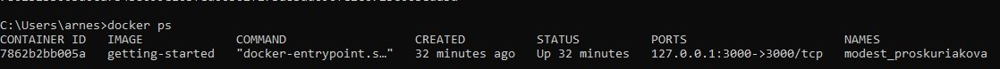
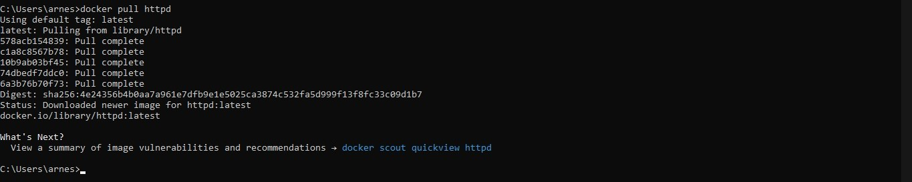
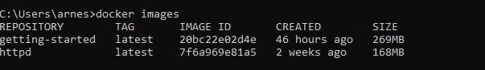
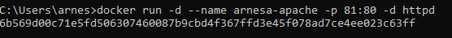
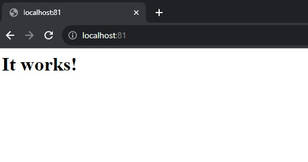

# Menjalankan Container Docker yang Berisi Image Apache

## Prerequisites
1. docker
2. git
3. apache

## Langkah-langkah

1. jalankan docker,anda juga bisa mengecek apakah sudah berjalan atau belum dengan perintah berikut:
   ```
   docker ps
   ```
   Jika docker sudah berstatus Running, maka ia akan memiliki tampilan seperti gambar di bawah ini

   
3. selanjutnya lakukan pull image Apache dengan perintah berikut di cmd:
   ```
   docker pull httpd
   ```
   Jika pull image Apache sudah selesai maka tampilan akan terlihat seperti berikut:

   
   
5. lihat list image docker dengan perintah berikut :
    ```
    docker images
    ```

    

6. lalu run countainer dengan perintah berikut :
    ```
    docker run -d --name arnesa-apache -p 81:80 -d httpd
    ```

    maka tampilan akam menjadi seperti berikut

    

7. Cek Browser Untuk Melihat Keberhasilan Menjalankan Docker dengan mengaksesnya melalui perintah berikut di browser anda :
   ```
   http://localhost:81
   ```

   sesuaikan dengan nama ip server : port anda,jika behasil maka akan muncul tampilan seprti berikut

   


selesai.


