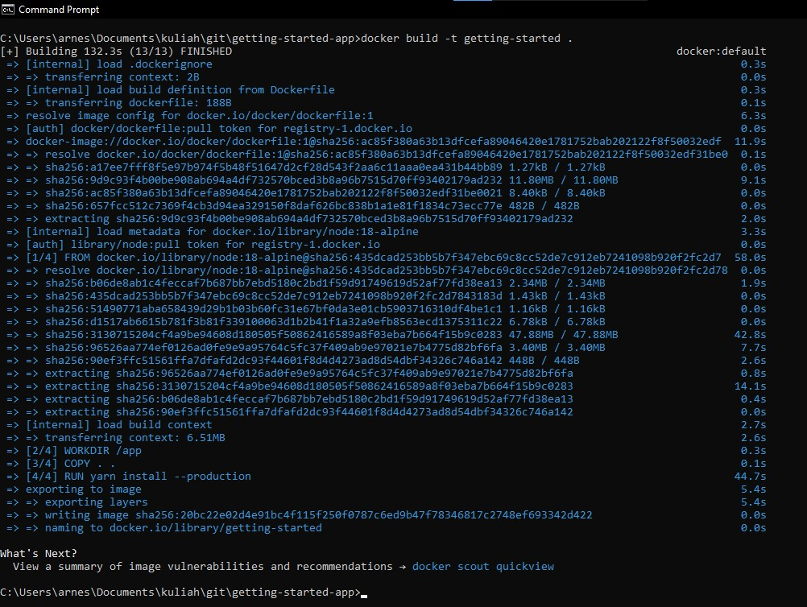

# Menginstal Docker via windows

## Prerequisites
1. docker Desktop
2. Git client
3. text editor


## Langkah-Langkah :

1. lakukan clone menggunakkan git bash pada link berikut :
   ```
   git clone https://github.com/docker/getting-started-app.git
   ```
2. setelah clone,akan ada beberapa file berikut di folder getting-started-app:

   `package.json`

   `README.md`

   `spec/`

   `src/`

   `yarn.lock`

3. lalu Build image,dengan cara buka command prompt,lalu arahkan ke folder `getting-started-app` yang telah anda clone tadi seperti berikut:
   ```
   cd \path\to\getting-started-app
   ```
4. buat file kosong dengan nama `Dockerfile`.
   ```
   type nul > Dockerfile
   ```
5. setelah file `Dockerfile` dibuat,edit menggunakan text editor lalu isikan sebagai berikut :
   ```
   # syntax=docker/dockerfile:1
   FROM node:18-alpine
   WORKDIR /app
   COPY . .
   RUN yarn install --production
   CMD ["node", "src/index.js"]
   EXPOSE 3000
   ```
6. pada cmd pastikan anda berada di folder `getting-started-app` lalu build image :
   ```
   docker build -t getting-started .
   ```
   
   
## Jalankan app container

1. lalu jalankan container dengan mengetikan `docker ru ` pada cmd sebagai berikut :
   ```
   docker run -dp 127.0.0.1:3000:3000 getting-started
   ```
2. setelah beberapa saat akan muncul tampilan seperti di gambar berikut :
   


    lalu buka browser anda dan ketikan link berikut :
    ```
    http://localhost:3000
    ```

    lalu pada jendela browser anda akan tampak sebagai berikut :

    
    
3. tampilan docker destop
   
   
   

4. selesai
