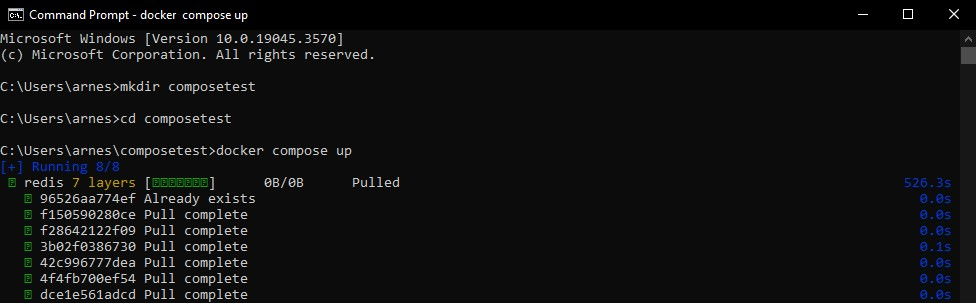
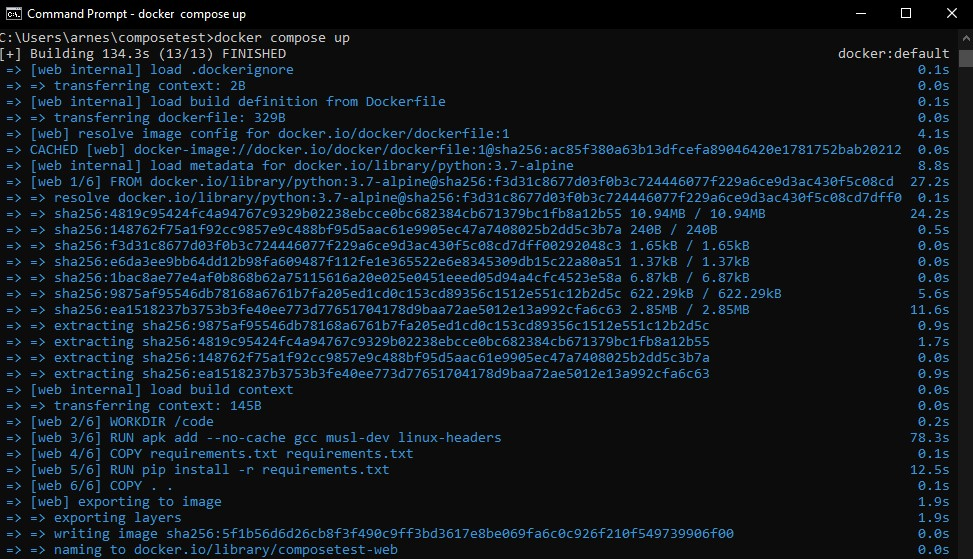
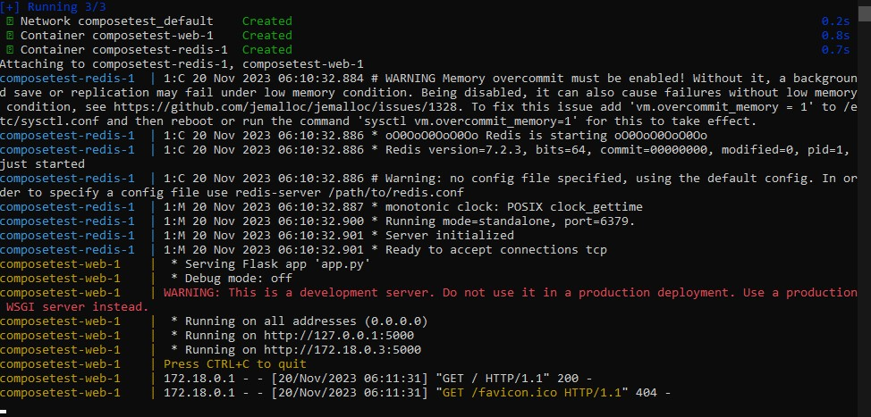
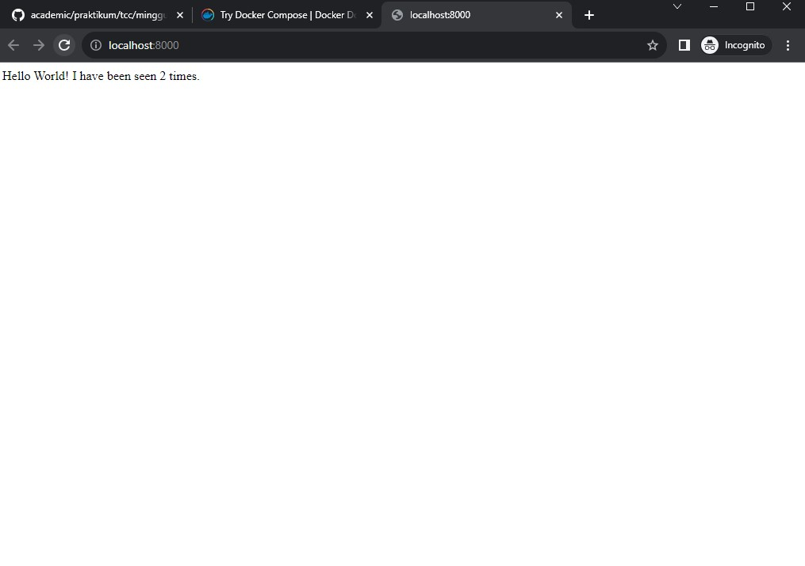
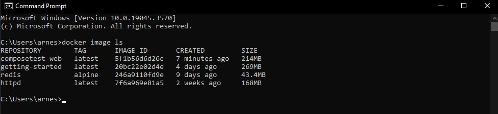
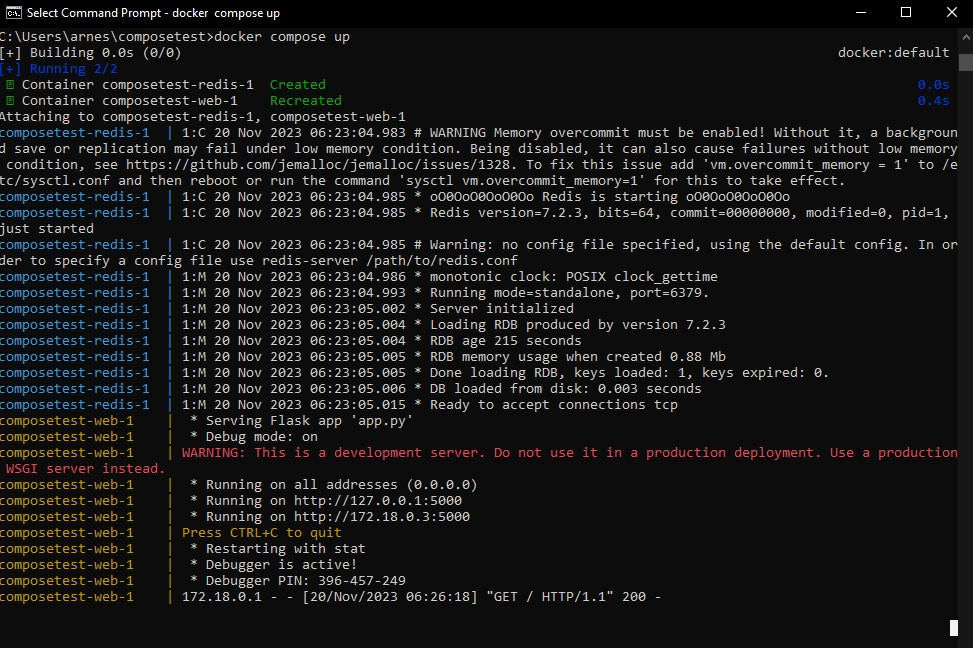
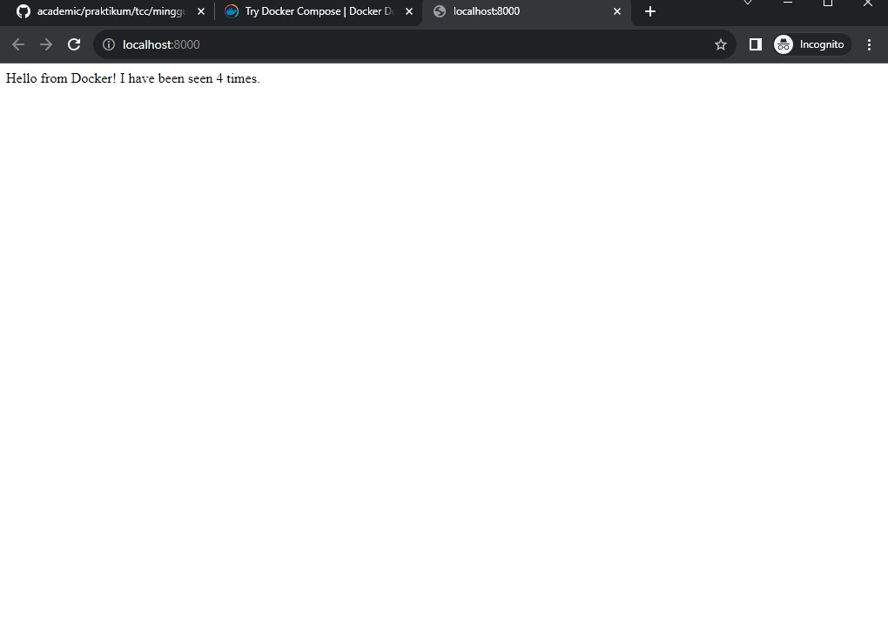

# Docker compose

## Prerequisites

1. Docker Desktop
2. Docker Engine
3. Docker Compose

## Langkah-langkah :

1. buat direktori untuk proyek,anda bisa menggunakan cmd dengan mengetikan perintah berikut :
   ```
   $ mkdir composetest
   $ cd composetest
   ```

2. Buat file bernama `app.py` di direktori proyek Anda dan tempelkan kode berikut di:
   ```
   import time

   import redis
   from flask import Flask

   app = Flask(__name__)
   cache = redis.Redis(host='redis', port=6379)

   def get_hit_count():
    retries = 5
    while True:
        try:
            return cache.incr('hits')
        except redis.exceptions.ConnectionError as exc:
            if retries == 0:
                raise exc
            retries -= 1
            time.sleep(0.5)
   @app.route('/')
   def hello():
    count = get_hit_count()
    return 'Hello World! I have been seen {} times.\n'.format(count)
   ```

3. Buat file `requirements.txt` di direktori proyek Anda dan tempelkan kode berikut di:
      ```
      flask
      redis
      ```
4. Di direktori proyek Anda, buat file bernama `Dockerfile.file` dan tempelkan kode berikut di:
   ```
    syntax=docker/dockerfile:1
   FROM python:3.7-alpine
   WORKDIR /code
   ENV FLASK_APP=app.py
   ENV FLASK_RUN_HOST=0.0.0.0
   RUN apk add --no-cache gcc musl-dev linux-headers
   COPY requirements.txt requirements.txt
   RUN pip install -r requirements.txt
   EXPOSE 5000
   COPY . .
   CMD ["flask", "run"]
   ```
Periksa apakah `Dockerfile` tidak memiliki ekstensi file seperti .txt. Beberapa editor mungkin menambahkan ekstensi file ini secara otomatis yang mengakibatkan kesalahan saat Anda menjalankan aplikasi.

5. Buat file bernama `compose.yaml` di direktori proyek Anda dan tempelkan yang berikut ini:
   ```
   services:
     web:
       build: .
       ports:
         - "8000:5000"
     redis:
       image: "redis:alpine"
   ```

6. Dari direktori proyek Anda, mulai aplikasi Anda dengan menjalankan `docker compose up`.
   
   
   

7. Masukkan `http://localhost:8000/` di browser untuk melihat aplikasi berjalan.
   Anda akan melihat pesan di browser Anda yang mengatakan:
   

8. Segarkan halaman.

Jumlahnya harus bertambah.


9. Beralih ke jendela terminal lain, dan ketik docker image lsuntuk mencantumkan gambar lokal.Daftar gambar pada titik ini harus kembali redisdan web.

    

10. Hentikan aplikasi, baik dengan menjalankan `docker compose down` dari dalam direktori proyek Anda di terminal kedua, atau dengan menekan CTRL+C di terminal asli tempat Anda memulai aplikasi.

11. selanjutnya Edit `compose.yaml` file di direktori proyek Anda untuk menambahkan pengikatan pengikatan untuk web layanan:
    ```
    services:
        web:
          build: .
          ports:
            - "8000:5000"
          volumes:
            - .:/code
          environment:
            FLASK_DEBUG: "true"
        redis:
          image: "redis:alpine"
    ```

12. jalankan kembali.Dari direktori proyek Anda, ketik `docker compose up` untuk membuat aplikasi dengan file Compose yang diperbarui, dan jalankan.
    
Periksa `Hello World` kembali pesan di browser web, dan segarkan untuk melihat penambahan jumlah.

13. Karena kode aplikasi kini dipasang ke dalam kontainer menggunakan volume, Anda dapat membuat perubahan pada kodenya dan melihat perubahannya secara instan, tanpa harus membuat ulang gambar.

Ubah salam `app.py` dan simpan. Misalnya, ubah `Hello World!` pesan menjadi `Hello from Docker!`:
   ```
   return 'Hello from Docker! I have been seen {} times.\n'.format(count)
   ```
Segarkan aplikasi di browser Anda. Salamnya harus diperbarui, dan penghitungnya harus tetap bertambah.



### selesai
