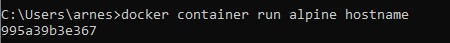
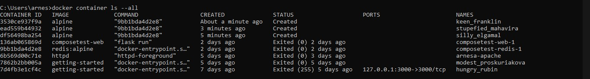
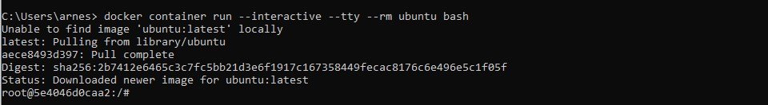
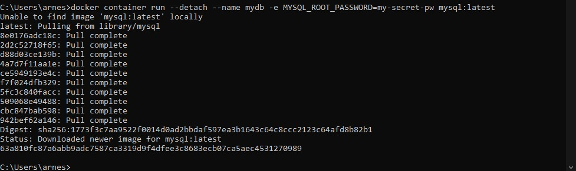
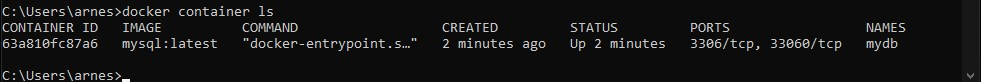
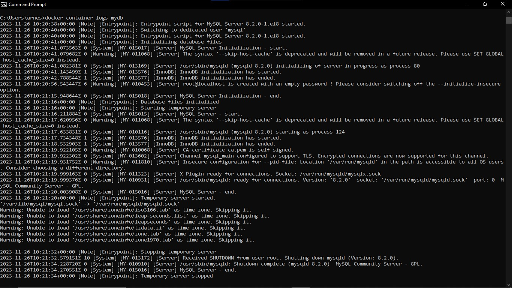
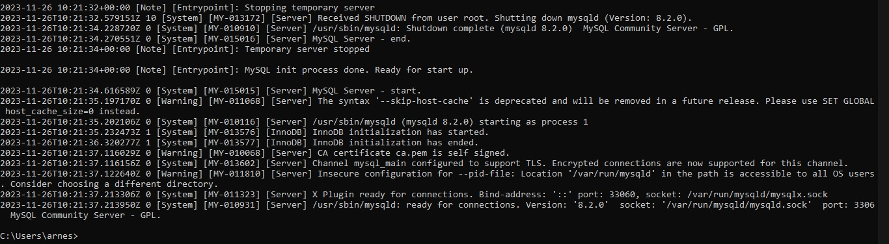
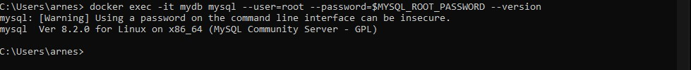

## Prerequisites

1. clone dari GitHub repo
   
   Gunakan perintah berikut untuk mengkloning repo lab dari GitHub
   ```
    git clone https://github.com/dockersamples/linux_tweet_app
   ```
2. DockerID

   Pastikan Anda memiliki DockerID,Jika Anda tidak memiliki DockerID (login gratis yang digunakan untuk mengakses Docker Hub), silakan     kunjungi Docker Hub dan daftar untuk mendapatkannya. Anda akan memerlukan ini untuk langkah selanjutnya.


## menjalankan container Docker sederhana

1. jalankan docker desktop anda
2. gunakan perintah berikut ini di cmd
   ```
   docker container run alpine hostname
   ```
   

3. lalu lihat Daftar semua kontainer
   ```
   docker container ls --all
   ```
   

   ID penampung adalah nama host yang ditampilkan penampung. Dalam contoh di atas itu `3530ce937f9a`.


## Run an interactive Ubuntu container

Anda dapat menjalankan container berdasarkan versi Linux yang berbeda dengan yang dijalankan pada host Docker Anda.disini kita akan menjalankan container Ubuntu Linux di atas host Alpine Linux Docker (Play With Docker menggunakan Alpine Linux untuk nodenya).

1. Jalankan container Docker dan akses shellnya.
   ```
    docker container run --interactive --tty --rm ubuntu bash
   ```
   
   


## Run a background MySQL container

1. Jalankan wadah MySQL baru dengan perintah berikut.

   ```
   docker container run \
    --detach \
    --name mydb \
    -e MYSQL_ROOT_PASSWORD=my-secret-pw \
    mysql:latest
   ```
   

2. Buat daftar container yang sedang berjalan.

   ```
   docker container ls
   ```
   Perhatikan kontainer Anda sedang berjalan.
   

3. periksa apa yang terjadi di container Anda dengan menggunakan beberapa perintah Docker bawaan: `docker container logs` dan `docker container top`.
   ```
   docker container logs mydb
   ```
   Ini menunjukkan log dari kontainer MySQL Docker.
   
   

4. Daftar versi MySQL menggunakan `docker container exec`.
   ```
    docker exec -it mydb \
    mysql --user=root --password=$MYSQL_ROOT_PASSWORD --version
   ```
   Anda akan melihat nomor versi MySQL.
   
