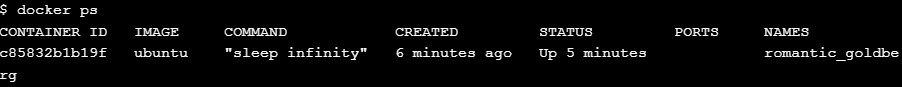

# Section #1 - Networking Basics

## Bagian #1 - Dasar-Dasar Jaringan

- Perintah tersebut docker networkmerupakan perintah utama untuk mengkonfigurasi dan mengelola jaringan kontainer. Jalankan perintah `docker network` dari terminal
   ```
   docker network
   ```
   

## Langkah 2: Buat daftar jaringan
- Jalankan perintah `docker network ls` untuk melihat jaringan kontainer yang ada di host Docker saat ini.
  ```
  docker network ls
  ```
  

## Langkah 3: Periksa jaringan
- lalu jalankan perintah :
  ```
  docker network inspect bridge
  ```
  

## Langkah 4: Buat daftar plugin driver jaringan
- Jalankan perintah `docker info` dan temukan daftar plugin jaringan.
  ```
  docker info
  ```
  


  # Section #2 - Bridge Networking
  
  ## Langkah 1: Dasar-dasar
  - Setiap instalasi Docker yang bersih dilengkapi dengan jaringan siap pakai yang disebut bridge . Verifikasi ini dengan `docker network ls`.
    ```
    docker network ls
    ```
    

Output di atas menunjukkan bahwa jaringan jembatan dikaitkan dengan driver jembatan . Penting untuk dicatat bahwa jaringan dan driver terhubung, tetapi keduanya tidak sama. Dalam contoh ini jaringan dan driver memiliki nama yang sama - namun keduanya bukanlah hal yang sama!

Output di atas juga menunjukkan bahwa jaringan jembatan dicakup secara lokal. Artinya jaringan hanya ada di host Docker ini. Hal ini berlaku untuk semua jaringan yang menggunakan driver bridge - driver bridge menyediakan jaringan host tunggal.

Semua jaringan yang dibuat dengan driver jembatan didasarkan pada jembatan Linux (alias saklar virtual).

Instal brctlperintah dan gunakan untuk membuat daftar jembatan Linux di host Docker Anda. Anda dapat melakukan ini dengan menjalankan sudo apt-get install bridge-utils.
```
apk update
apk add bridge
```

Kemudian, daftarkan jembatan pada host Docker Anda, dengan menjalankan `brctl show`.
```
brctl show
```


   ## Langkah 2: Hubungkan kontainer

   - Buat wadah baru dengan menjalankan `docker run -dt ubuntu sleep infinity`.
     ```
     docker run -dt ubuntu sleep infinity
     ```
     
  
   - Anda dapat memverifikasi bahwa wadah contoh kami sudah aktif dengan menjalankan `docker ps`
     
   - Jalankan `brctl show` perintah lagi.
     

     ## Langkah 3: Uji konektivitas jaringan
     - Ping alamat IP wadah dari prompt shell host Docker Anda dengan menjalankan `ping -c5 <IPv4 Address>`. Ingatlah untuk menggunakan IP wadah di lingkungan Anda .
       
     - Pertama, kita perlu memulai ID container pada langkah sebelumnya. Anda bisa lari docker psuntuk mendapatkannya.
       ```
       docker ps
       ```
       
     - Selanjutnya, mari kita jalankan shell di dalam container ubuntu tersebut, dengan menjalankan docker exec -it <CONTAINER ID> /bin/bash
       
     - Selanjutnya kita perlu menginstal program ping. Jadi, ayo lari `apt-get update && apt-get install -y iputils-ping`.
       ```
       apt-get update && apt-get install -y iputils-ping
       ```
     - Mari kita ping ke www.github.com dengan menjalankan `ping -c5 www.github.com`
       
     - Terakhir, lepaskan shell kita dari container, dengan menjalankan exit.
       ```
       exit
       ```
       ## Langkah 4: Konfigurasikan NAT untuk konektivitas eksternal
       - Mulai container baru berdasarkan image resmi NGINX dengan menjalankan `docker run --name web1 -d -p 8080:80 nginx`.
         ```
         docker run --name web1 -d -p 8080:80 nginx
         ```
         
       - Tinjau status kontainer dan pemetaan port dengan menjalankan `docker ps`.
         
Baris teratas menunjukkan container web1 baru yang menjalankan NGINX. Catat perintah yang dijalankan container serta pemetaan port - 0.0.0.0:8080->80/tcpmemetakan port 8080 di semua antarmuka host ke port 80 di dalam container web1 . Pemetaan port inilah yang secara efektif membuat layanan web container dapat diakses dari sumber eksternal (melalui alamat IP host Docker pada port 8080).

Sekarang container sudah berjalan dan dipetakan ke port pada antarmuka host, Anda dapat menguji konektivitas ke server web NGINX.

   # Section #3 - Overlay Networking
   ## Langkah 1: Dasar-dasar
   - jalankan `docker swarm init --advertise-addr $(hostname -i)`.
     

     Di terminal pertama salin seluruh docker swarm join ...perintah yang ditampilkan sebagai bagian dari keluaran dari keluaran terminal Anda. Kemudian, tempelkan perintah yang disalin ke terminal kedua.
     ```
     docker swarm join --token SWMTKN-1-69b2x1u2wtjdmot0oqxjw1r2d27f0lbmhfxhvj83chln1l6es5-37ykdpul0vylenefe2439cqpf 10.0.0.5:2377

     ```
   - Jalankan a `docker node ls` untuk memverifikasi bahwa kedua node adalah bagian dari Swarm.
     ```
     docker node ls
     ```
     

   ## Langkah 2: Buat jaringan overlay
   - Buat jaringan overlay baru yang disebut "overnet" dengan menjalankan `docker network create -d overlay overnet`.
     ```
     docker network create -d overlay overnet
     ```
     

   - Gunakan `docker network ls` perintah untuk memverifikasi jaringan berhasil dibuat.
     

   ## Langkah 3: Buat layanan
   - Jalankan perintah berikut dari terminal pertama untuk membuat layanan baru bernama myservice di jaringan overnet dengan dua tugas/replika.
     ```
     docker service create --name myservice --network overnet --replicas 2 ubuntu sleep infinity
     ```
     

     Verifikasi bahwa layanan telah dibuat dan kedua replika sudah aktif dengan menjalankan `docker service ls`.
     

     2/2Kolom di menunjukkan REPLICASbahwa kedua tugas di layanan aktif dan berjalan.
     Verifikasi bahwa satu tugas (replika) berjalan pada masing-masing dari dua node di Swarm dengan menjalankan docker service ps myservice.
     ```
     docker service ps myservice
     ```
     

   ## Langkah 4: Uji jaringan
   - Jalankan perintah berikut dari terminal pertama.
     ```
     docker network inspect overnet
     ```
     
   - Jalankan docker psperintah untuk mendapatkan ID tugas layanan sehingga Anda bisa masuk ke dalamnya pada langkah berikutnya.
     ```
     docker ps
     ```
     
   - Masuk ke tugas layanan. Pastikan untuk menggunakan wadah IDdari lingkungan Anda karena akan berbeda dari contoh yang ditunjukkan di bawah. Kita bisa melakukan ini dengan menjalankan `docker exec -it <CONTAINER ID> /bin/bash`.
     
   - Instal perintah ping dan ping tugas layanan yang berjalan pada node kedua yang memiliki alamat IP 10.0.0.3dari docker network inspect overnetperintah tersebut.
     ```
     apt-get update && apt-get install -y iputils-ping
     ```
     

   - Sekarang, mari kita ping 10.0.0.3.
     ```
     ping -c5 10.0.0.3
     ```

     Output di atas menunjukkan bahwa kedua tugas dari layanan myservice berada di jaringan overlay yang sama yang mencakup kedua node dan keduanya dapat menggunakan jaringan ini untuk berkomunikasi.

     
     

     
     

       
       
       
