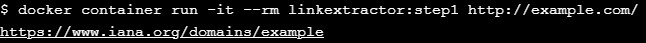
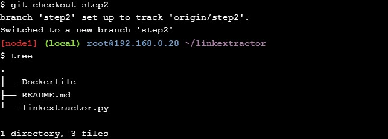
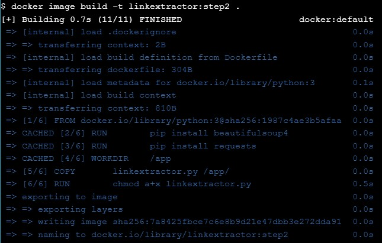

# Application Containerization and Microservice Orchestration
## Stage Setup
1. clone repositori demo code berikut :
```
git clone https://github.com/ibnesayeed/linkextractor.git
cd linkextractor
git checkout demo
```

## Step 0: Basic Link Extractor Script
1. periksa `step0` cabang dan daftar file didalamnya
```
git checkout step0
tree
```


## Step 1: Containerized Link Extractor Script
1. periksa `step1` cabang dan daftar file didalamnya
```
git checkout step1
tree
```

2. selanjutnya jalankan perintah berikut :
```
docker image build -t linkextractor:step1 .
```

image Docker yang diberi nama `linkextractor:step1` berdasarkan Dockerfile ilustrasi di atas. Jika build berhasil, anda akan melihatnya di daftar image:
```
docker image ls
```

3.  Sekarang, jalankan container satu kali dengan image ini dan ekstrak link dari beberapa halaman web yang aktif:
```
docker container run -it --rm linkextractor:step1 http://example.com/
```


## Step 2: Link Extractor Module with Full URI and Anchor Text
1. Periksa `step2` cabang dan daftar file di dalamnya.
```
git checkout step2
tree
```

2. lalu jalankan perintah berikut 
```
docker image build -t linkextractor:step2 .
```

3. lalu periksa image menggunakan perintah berikut :
```
docker image ls
```
4. jalankan container satu kali menggunakan `linkextractor:step2` image sekarang akan menghasilkan output yang lebih baik:
```
docker container run -it --rm linkextractor:step2 https://training.play-with-docker.com/
```
5. jalankan container menggunakan image sebelumnya `linkextractor:step1` masih akan menghasilkan keluaran lama:
```
docker container run -it --rm linkextractor:step1 https://training.play-with-docker.com/
```

## Step 3: Link Extractor API Service
1. Periksa `step3` cabang dan daftar file di dalamnya.
```
git checkout step3
tree
```
akan tampak seperti berikut :
```
.
├── Dockerfile
├── README.md
├── linkextractor.py
├── main.py
└── requirements.txt

0 directories, 5 files
```

