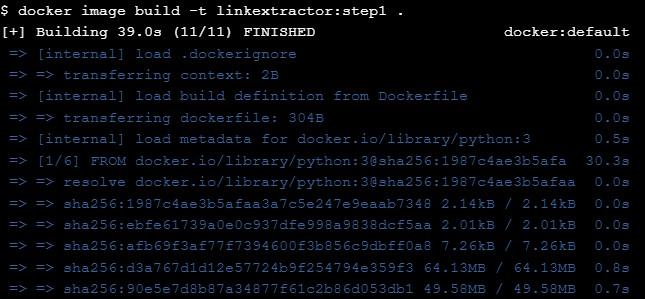

# Application Containerization and Microservice Orchestration
## Stage Setup
1. clone repositori demo code berikut :
```
git clone https://github.com/ibnesayeed/linkextractor.git
cd linkextractor
git checkout demo
```

## Step 0: Basic Link Extractor Script
1. periksa `step0` cabang dan daftar file didalamnya
```
git checkout step0
tree
```


## Step 1: Containerized Link Extractor Script
1. periksa `step1` cabang dan daftar file didalamnya
```
git checkout step1
tree
```

2. selanjutnya jalankan perintah berikut :
```
docker image build -t linkextractor:step1 .
```

image Docker yang diberi nama `linkextractor:step1` berdasarkan Dockerfile ilustrasi di atas. Jika build berhasil, anda akan melihatnya di daftar image:
```
docker image ls
```

