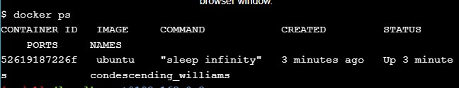
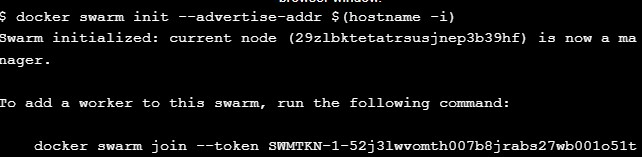

# Docker Orchestration Hands-on Lab

##  What is Orchestration?
Jadi, apa sebenarnya Orkestrasi itu? Ya, Orkestrasi mungkin paling baik dijelaskan dengan menggunakan sebuah contoh. Katakanlah Anda memiliki aplikasi yang memiliki lalu lintas tinggi dan persyaratan ketersediaan tinggi. Karena persyaratan ini, Anda biasanya ingin menerapkan setidaknya di 3+ ​​mesin, sehingga jika sebuah host gagal, aplikasi Anda masih dapat diakses dari setidaknya dua mesin lainnya. Tentu saja, ini hanyalah sebuah contoh dan kasus penggunaan Anda kemungkinan besar memiliki persyaratannya sendiri, tetapi Anda mengerti maksudnya.

Menyebarkan aplikasi Anda tanpa Orkestrasi biasanya sangat memakan waktu dan rawan kesalahan, karena Anda harus melakukan SSH secara manual ke setiap mesin, memulai aplikasi Anda, dan terus mengawasi berbagai hal untuk memastikan aplikasi berjalan sesuai harapan.

Namun, dengan peralatan Orkestrasi, Anda biasanya dapat melepaskan sebagian besar pekerjaan manual ini dan membiarkan otomatisasi melakukan pekerjaan berat. Salah satu fitur keren Orkestrasi dengan Docker Swarm adalah Anda dapat menerapkan aplikasi di banyak host hanya dengan satu perintah (setelah mode Swarm diaktifkan). Selain itu, jika salah satu node pendukung mati di Docker Swarm Anda, node lain akan secara otomatis mengambil beban, dan aplikasi Anda akan terus berjalan seperti biasa.

## 1. Configure Swarm Mode
```
docker run -dt ubuntu sleep infinity
```
Perintah ini akan membuat container baru berdasarkan gambar ubuntu:latest dan akan menjalankan perintah sleep agar container tetap berjalan di latar belakang.

```
docker ps
```


## 2. Create a Manager node

Jalankan `docker swarm init` di node1.
```
docker swarm init --advertise-addr $(hostname -i)
```


## 3. Join Worker nodes to the Swarm
1. Anda akan melakukan prosedur berikut pada node2 dan node3 . Menjelang akhir prosedur Anda akan beralih kembali ke node1 .

Sekarang, ambil seluruh docker swarm join ...perintah yang kita salin sebelumnya dari `node1` tempat ia ditampilkan sebagai keluaran terminal. Kita perlu menempelkan perintah yang disalin ke terminal node2 dan node3 .
Ingat, token yang ditampilkan di sini bukanlah token sebenarnya yang akan Anda gunakan. Salin perintah dari output pada node1 . Pada node2 dan node3 akan terlihat seperti ini:
```
docker swarm join \
--token SWMTKN-1-1wxyoueqgpcrc4xk2t3ec7n1poy75g4kowmwz64p7ulqx611ih-68pazn0mj8p4p4lnuf4ctp8xy \
10.0.0.5:2377
```
```
docker swarm join \
--token SWMTKN-1-1wxyoueqgpcrc4xk2t3ec7n1poy75g4kowmwz64p7ulqx611ih-68pazn0mj8p4p4lnuf4ctp8xy \
10.0.0.5:2377
```
2. Setelah Anda menjalankan ini pada node2 dan node3 , beralih kembali ke node1 , dan jalankan `docker node ls`
   ```
   docker node ls
   ```
   
Perintah ini docker node lsmenunjukkan kepada Anda semua node yang ada di gerombolan serta perannya dalam gerombolan tersebut. Ini *mengidentifikasi node tempat Anda mengeluarkan perintah.

## 4. Deploy applications across multiple hosts 
1. Deploy the application components as Docker services
   
