# Minikube

## Objectives 
- Deploy contoh aplikasi ke minikube.
- Jalankan aplikasi.
- Lihat log aplikasi.

## minikube start
1. Unduh dan jalankan penginstal [disini](https://translate.google.com/website?sl=auto&tl=id&hl=id&client=webapp&u=https://storage.googleapis.com/minikube/releases/latest/minikube-installer.exe)
2. Tambahkan `minikube.exe` biner ke file `PATH`.Pastikan untuk menjalankan PowerShell sebagai Administrator.
3. Start your cluster
   ```
   minikube start
   ```
   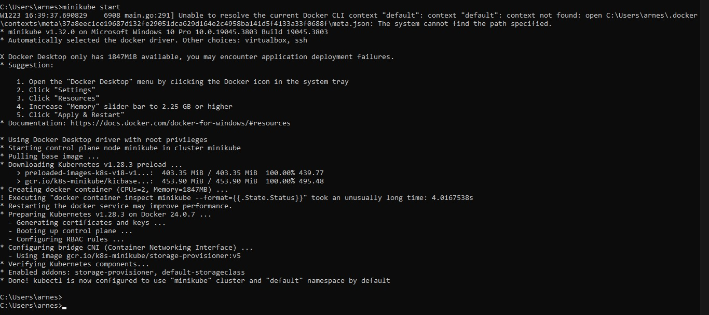

4. Buka dasbor Kubernetes
   ```
   minikube dashboard
   ```
   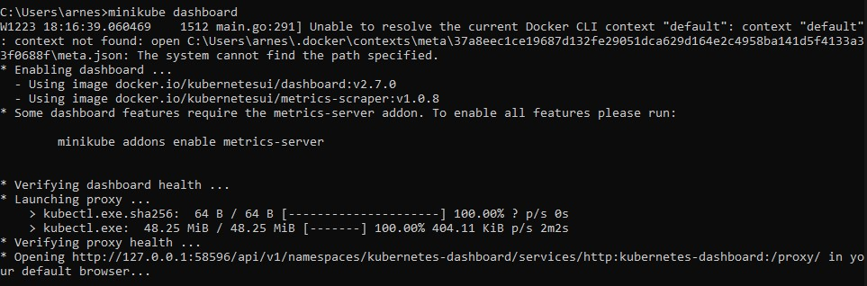

## Create a Deployment

1. Gunakan `kubectl create` perintah untuk membuat Deployment yang mengelola sebuah Pod. Pod menjalankan sebuah Container berdasarkan image Docker yang disediakan.
   ```
   kubectl create deployment hello-node --image=registry.k8s.io/e2e-test-images/agnhost:2.39 -- /agnhost netexec --http-port=8080
   ```
   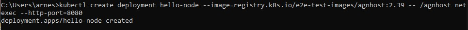

2. View the Deployment:
   ```
   kubectl get deployments
   ```
   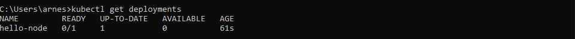

3. View the Pod:
   ```
   kubectl get pods
   ```
   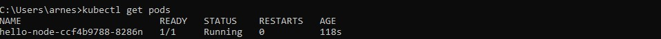

4. View cluster events:
   ```
   kubectl get events
   ```
   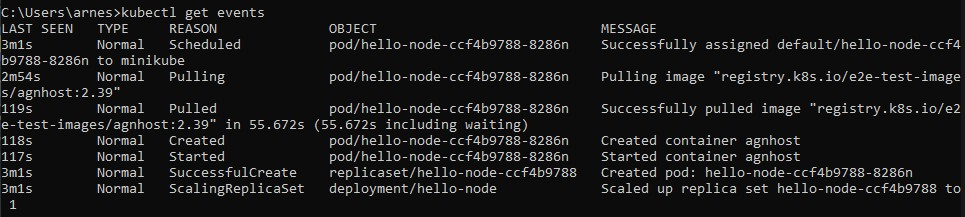

5. View the configuration:
   ```
   kubectl config view
   ```
   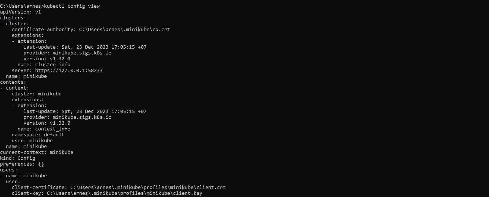

6. Melihat log aplikasi untuk sebuah container di dalam pod.
   ```
   kubectl logs hello-node-5f76cf6ccf-br9b5
   ```
   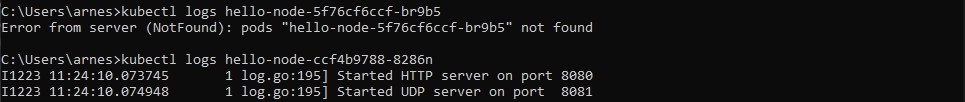

## Create a Service
1. Ekspos Pod ke internet publik menggunakan `kubectl expose` perintah:
   ```
   kubectl expose deployment hello-node --type=LoadBalancer --port=8080
   ```
   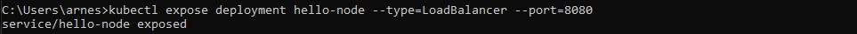
2. Lihat Layanan yang telah di buat:
   ```
   kubectl get services
   ```
   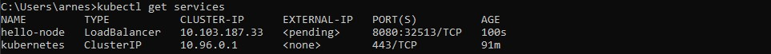
3. Jalankan perintah berikut:
   ```
   minikube service hello-node
   ```
   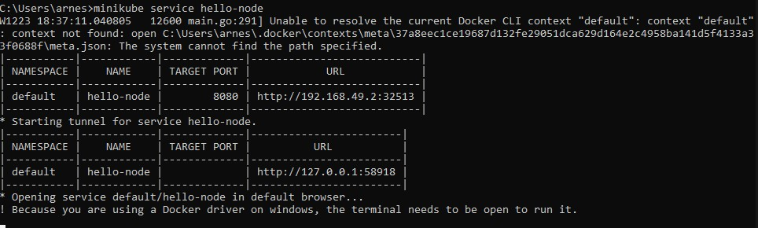
   Ini akan membuka jendela browser yang menyajikan aplikasi Anda dan menampilkan respons aplikasi.
   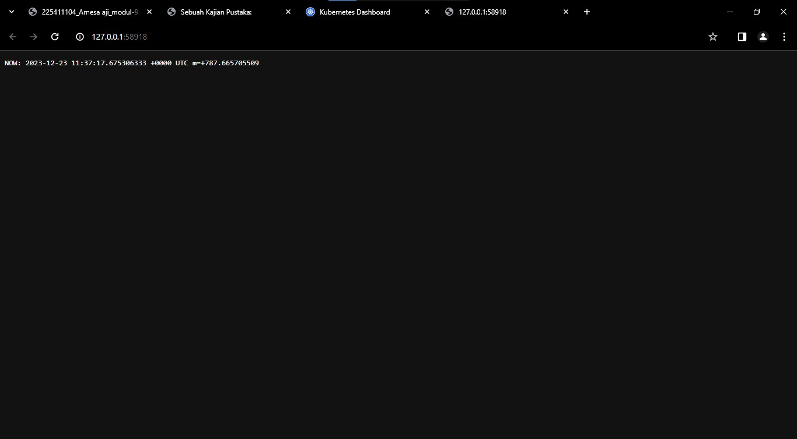
